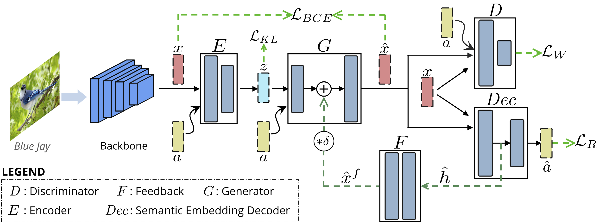
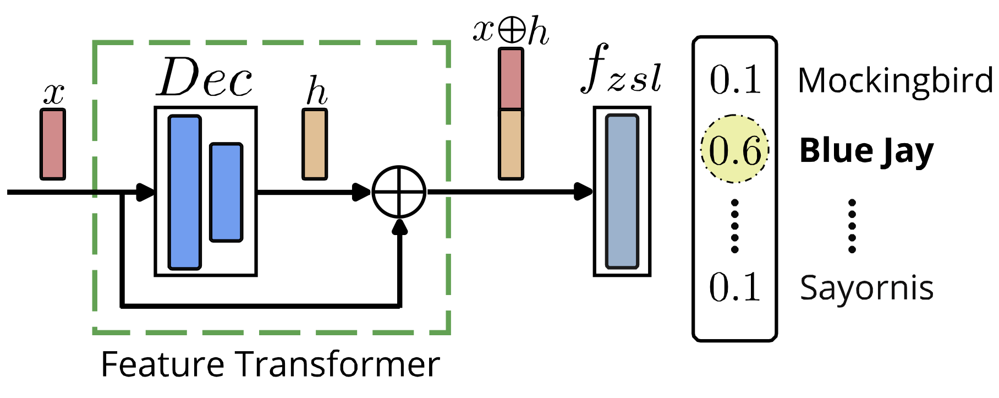
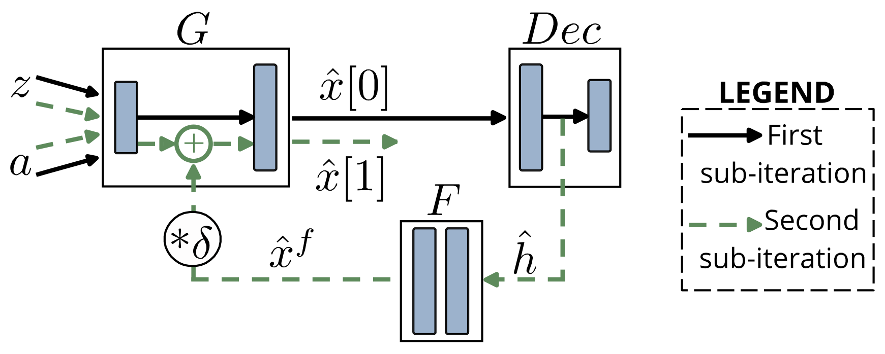

# Latent Embedding Feedback and Discriminative Features for Zero-Shot Classification (ECCV 2020)

#### [Sanath Narayan](https://scholar.google.com/citations?user=Bx7EFGoAAAAJ&hl=en)<sup>\*</sup>, [Akshita Gupta](https://scholar.google.com/citations?user=G01YeI0AAAAJ&hl=en)<sup>\*</sup>, [Fahad Shahbaz Khan](https://scholar.google.es/citations?user=zvaeYnUAAAAJ&hl=en), [Cees G. M. Snoek](https://scholar.google.com/citations?hl=en&user=0uKdbscAAAAJ&view_op), [Ling Shao](https://scholar.google.com/citations?user=z84rLjoAAAAJ&hl=en) ####

**Paper:** https://arxiv.org/abs/2003.07833

**Code:** Coming Soon

## **Overall Architecture:** 

<p align="center">
  
  <br/>
  <br/>
  <b> Overall Framework for TF-Vaegan </b>
</p>

<table>
  <tr>
    <td>  </td>
    <td>  </td>
  </tr>
  <tr >
    <td><p align="center"><b> Discriminative Feature Transformation </b></p></td>
    <td><p align="center"> <b> Feedback Module </b></p></td>
  </tr>
</table>

If you find this useful, please cite our work as follows:
```
@article{narayan2020latent,
  title={Latent Embedding Feedback and Discriminative Features for Zero-Shot Classification},
  author={Narayan, Sanath and Gupta, Akshita and Khan, Fahad Shahbaz and Snoek, Cees GM and Shao, Ling},
  journal={arXiv preprint arXiv:2003.07833},
  year={2020}
}
```

## Installation
The model is built in PyTorch 0.3.1 and tested on Ubuntu 16.04 environment (Python3.6, CUDA9.0, cuDNN7.5).

For installing, follow these intructions
```
conda env create -f environment.yml
conda activate pytorch0.3.1
```
## Training

### Zero-Shot Image Classification
```
CUB : python image_scripts/run_cub_tfvaegan.py
AWA : python image_scripts/run_awa_tfvaegan.py
FLO : python image_scripts/run_flo_tfvaegan.py
SUN : python image_scripts/run_sun_tfvaegan.py

```
### Zero-Shot Action Classification
```
HMDB51 : python action_scripts/run_hmdb51_tfvaegan.py
UCF101 : python action_scripts/run_ucf101_tfvaegan.py

```

## Contact:
Should you have any question, please contact sanath.narayan@inceptioniai.org or akshita.gupta@inceptioniai.org
